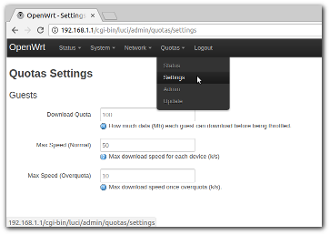
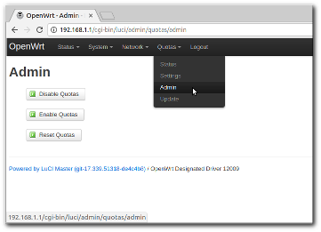
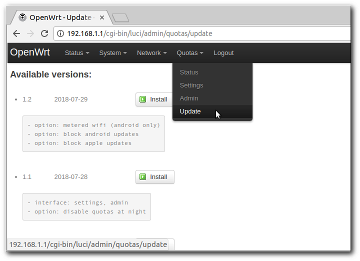

OpenWRT Quotas
==============

Download quotas per mac address for [OpenWRT](http://openwrt.org) routers.  
This project focuses on OpenWRT but shouldn't be hard to port to other Linux routers/distributions.

### Scenario

You have an open wifi with many guests, your internet connection's
monthly allowance is getting eaten up fast (or some guests are hogging
the bandwidth) and you need to limit downloads somehow.

Usual solution is to setup a captive portal: guests will need to authenticate and you can have download quotas.  
Heavy and not so user friendly. You'll probably need extra hardware to run the portal.

How about this instead: keep wifi open but
1. Limit each guest to say, 50k/s max.
2. Each guest starts with 100 Mb download quota.
3. Once overquota download speed is throttled to 10k/s.

This way kids going on youtube can't eat up all the bandwidth, network remains
open, and in the worst case if someone goes overquota he can still check email etc.
You can also adapt to circumstances by tweaking the limits : Expect huge number of guests
for the weekend ? Lower speed and quota. Lots of bandwidth remaining ? Relax the rules etc.

------------------------------------------------------------------------------------

### Installation

You need:  
- Router supported by [OpenWRT](http://openwrt.org) with at least 8Mb flash.
- Ipset support (tested with OpenWRT 15.05 and 16.xx, but other releases should do (LEDE untested).

Using a TP-Link TL-WR810N with OpenWRT 16.xx here: Small form factor, costs about $30 and works nicely.

**Setup:**
- Flash OpenWRT firmware and configure router:  
  Go to the [downloads](https://openwrt.org/downloads), find the firmware for your router
  and follow the instructions there.
- First install: Install package through ssh:

      ssh root@192.168.1.1
      # opkg update
      # opkg install wget
      # cd /tmp
      # wget --no-check-certificate 'https://lemonsqueeze.github.io/OpenWRTQuotas/releases/openwrt/generic/download-quotas_1.2.ipk'
      # opkg install download-quotas_1.2.ipk
  
Tips:
- If web interface is missing after flashing openwrt you need to
  [install luci](https://wiki.openwrt.org/doc/howto/luci.essentials).
- If you need more range / your fancy wifi router isn't supported you can also chain the two:
  For example, TP-Link in ethernet-only mode between WAN and wifi router,
  the other router does the wifi. Best of both worlds.
- This won't work for 4Mb flash routers. You might be able to hack around but it won't be pretty,
  device is too space-constrained. No https support. You'll need a custom build and install
  package manually.

------------------------------------------------------------------------------------

### Interface

Package adds a `Quotas` tab to openwrt's admin interface.  
Login and tweak settings from there:

Use Admin tab to enable/disable quotas:

New releases can be installed from the Update tab:

> Note: At the moment it's not possible to use OpenWRT's firewall and download-quotas at the same time:
download-quotas will wipe firewall rules when it starts and vice-versa.
Currently firewall service is disabled when installing download-quotas.
If you have have custom rules or create some through web interface they will not take effect.
(TODO: integrate the two ...)

------------------------------------------------------------------------------------

### Security

This is by no means secure, however with a typical crowd of non-hostile guests it works pretty well:  

- Mac addresses can be changed, if a guest does so he'll get a brand new quota.  
- Limits only kick in for the dhcp ip range. If there are addresses left out
  a guest can bypass limits by using one of these ips (could be a feature too if you need
  priviledged users. A better way would be to add special rules for them).  
- The mac/ip tracking logic runs every minute so when a pairing changes there's a window of
  at most 1 minute where a guest could be running on someone else's quota. Pairing changes are
  rare enough and in the worst case, at 100k/s the potential for abuse is small enough that
  it doesn't matter.

------------------------------------------------------------------------------------

### Source

- `base` branch has minimal scripts which are not openwrt specific. No ui.
  Should be fairly easy to port to other distros.
- `openwrt` branch adds admin interface and some extra features (openwrt specific).

See [HACKING](HACKING.md) for details.
